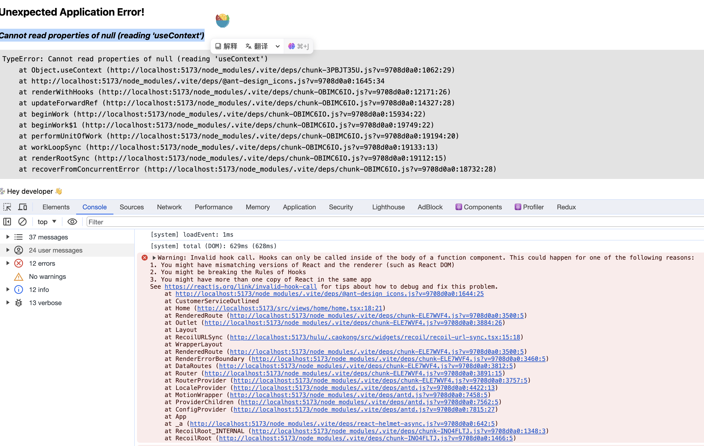

# 错误集

## Cannot read properties of null (reading 'useContext')



### 原因分析

package.dependencies link 本地开发包，造成 auto imports Antd icons 时报错

### 解决方案

配置文件添加文件
```ts
// config.ts
{
    resolve: {
        // 启用此选项会使 Vite 通过原始文件路径（即不跟随符号链接的路径）而不是真正的文件路径（即跟随符号链接后的路径）确定文件身份。
        preserveSymlinks: true
    }
}
```

### 实际应用

鱼与熊掌不可兼得，若使用 preserveSymlinks, 那么就少了 link 的实时变化，且在vite下添加缓存，还不能直接在 package.json 中直接安装包来的方便

## Warning: Invalid attribute `ref` supplied to `React.Fragment`.

### 原因分析

Met 下使用 Fragment 下没有去除 ref, 

### 解决方案

使用 `react-is` 的 isFragement 判断，去除写入 ref 和 其它的props  
