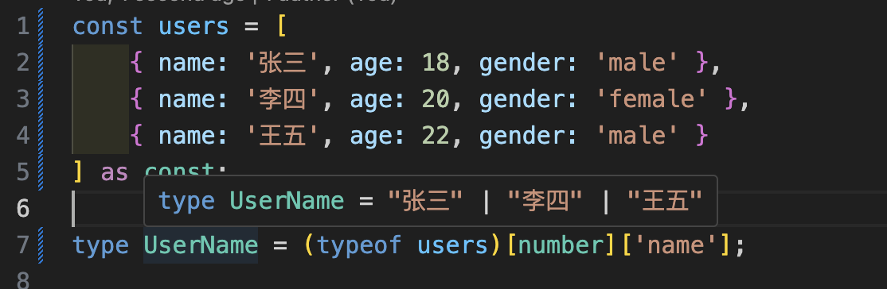
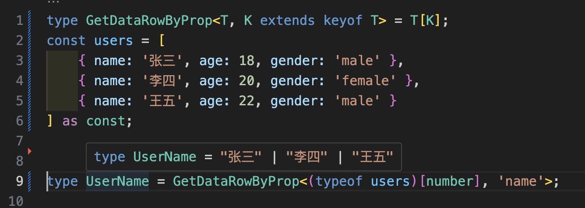

# 常用类型集合

## 获取数组中元素对象属性的值作为新类型

`as const` 是关键

```ts
const users = [
    { name: '张三', age: 18, gender: 'male' },
    { name: '李四', age: 20, gender: 'female' },
    { name: '王五', age: 22, gender: 'male' }
] as const;

type UserName = (typeof users)[number]['name'];
type UserAge = (typeof users)[number]['age'];
```



### 封装下 GetDataRowByProp 

```ts
type GetDataRowByProp<T, K extends keyof T> = T[K];
const users = [
    { name: '张三', age: 18, gender: 'male' },
    { name: '李四', age: 20, gender: 'female' },
    { name: '王五', age: 22, gender: 'male' }
] as const;

type UserName = GetDataRowByProp<(typeof users)[number], 'name'>;
```



