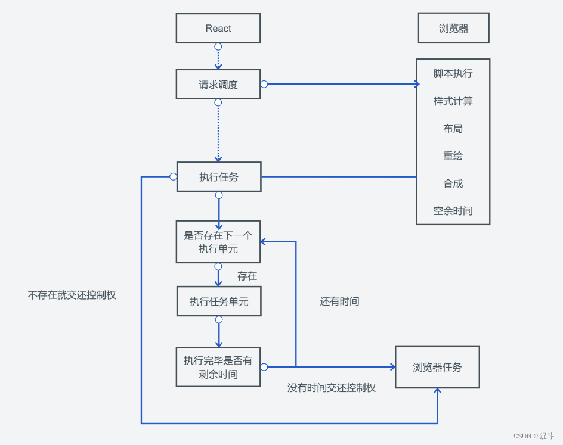
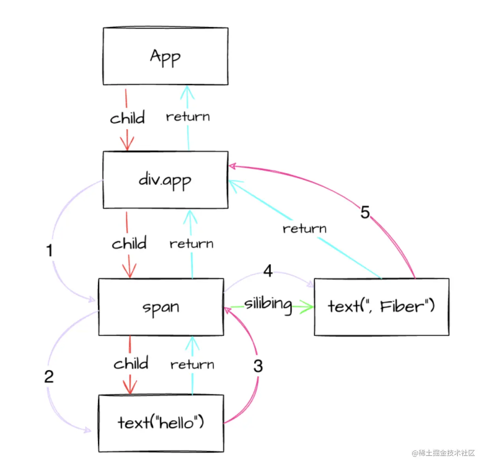
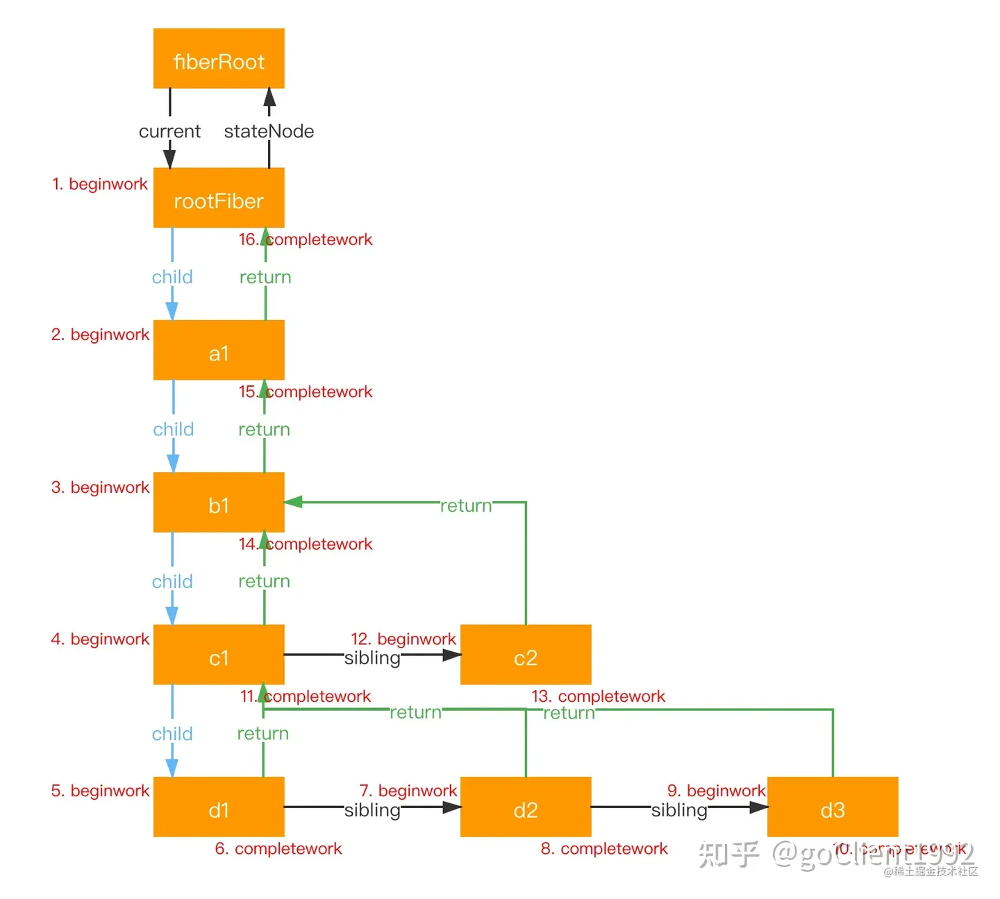
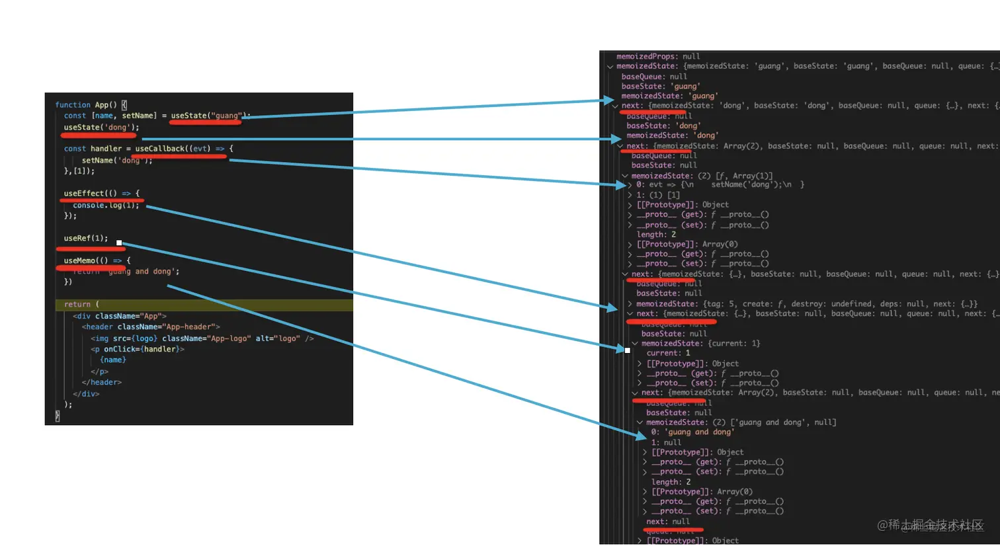
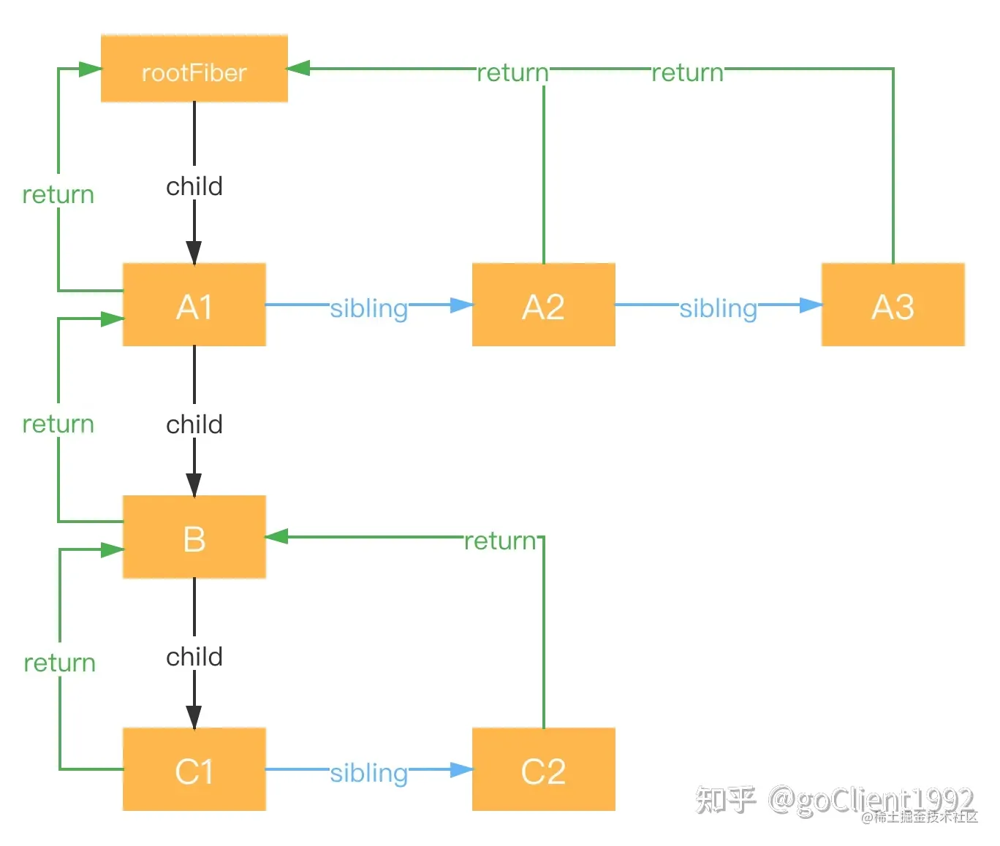

# React Fiber

在深入了解FIber之前，我们可以先了解一下React的架构发展历程：

***React15架构可以分为两层***：
Reconciler（协调器）—— 负责找出变化的组件；
Renderer（渲染器）—— 负责将变化的组件渲染到页面上；

***React16架构可以分为三层***：
Scheduler（调度器）—— 调度任务的优先级，高优任务优先进入Reconciler；
Reconciler（协调器）—— 负责找出变化的组件：更新工作从递归变成了可以中断的循环过程。`Reconciler内部采用了Fiber的架构`；
Renderer（渲染器）—— 负责将变化的组件渲染到页面上

## Fiber

```ts
type Fiber = {
    /**
     * Tag identifying the type of fiber. 
     * 当前Fiber的类型
     * 在React Fiber中，WorkTag是一个用于标记任务的位向量。
     * 它用于标识任务的优先级和类型，以便在执行任务时进行调度。每个WorkTag都由多个位组成，每个位代表一个不同的属性。
     * 例如，一个位可以表示任务的优先级，另一个位可以表示任务的类型（如渲染任务或副作用任务）。
     * 通过使用WorkTag，React Fiber可以更灵活地管理和调度任务。
     * 在React Fiber的执行过程中，它会根据WorkTag的优先级和类型来选择下一个要执行的任务。
     * 这样可以确保高优先级的任务先于低优先级的任务执行，同时不同类型的任务也可以分开处理。
     */
    tag: WorkTag

    /**
     * Unique identifier of this child.
     * 唯一标识符
     * key 和 type 两项用于 react diff 过程中确定 fiber 是否可以复用。
     * key 为用户定义的唯一值。type 定义与此fiber关联的功能或类。
     * 对于组件，它指向函数或者类本身；对于DOM元素，它指定HTML tag。
     */
    key: null | string,

    /**
     * The value of element.type which is used to preserve the identity during reconciliation of this child.
     * 在不同子元素之间保持身份相同的字段是唯一的。
     * 当前Fiber对应的节点的类型，classComponent FunctionCompoent element.tagName，一般和下面的type相同
     */
    elementType: any,

    /**
     * The resolved function/class/ associated with this fiber.
     * 与该 fiber 关联的函数类 
     * 和上面的elementType相同，但是在LazyComponent时，type=null
     */ 
    type: any,
    
    /**
     * 与该 fiber 关联的本地状态，指向真实 DOM 对象
     * satteNode 有四种情况
     * 1. functionCoponent stateNode = null
     * 2. classComponent stateNode = instance
     * 3. Dom类型， stateNode 为当前dom实例
     * 4. rootFiber stateNode = fiberRoot
     * - 
     * stateNode 用于记录当前 fiber 所对应的真实 dom 节点或者当前虚拟组件的实例，
     * 这么做的原因第一是为了实现 Ref，
     * 第二是为了实现真实 dom 的跟踪。
     */ 
    stateNode: any,

    /**
     * parent Fibers
     * parent : Instance -> return 由于我们将 fiber 和 instance 合并在一起，所以这个返回值是相同的。
     * 其它剩余的字段属于 Fiber。
     * 完成处理当前 fiber 后需要返回的 fiber。
     * 从技术上来说，它等同于父级，但可以有多个父级（两个），所以这只是当前处理的 thing 的返回地址。
     * 从概念上来说，它等同于 stack frame 的返回地址。
     */ 
    return: Fiber | null,

    /**
     * 当前fiber的第一个子节点
     */ 
    child: Fiber | null,

    /**
     * 当前节点的兄弟节点
     */ 
    sibling: Fiber | null,

    /**
     * 当前节点的位置
     */ 
    index: number,

    /**
     * 上一次使用的用于绑定此节点的 ref
     * 在产品中我避免添加 owner 字段，将其建模为函数
     */ 
    ref:
      | null
      | (((handle: mixed) => void) & {_stringRef: ?string, ...})
      | RefObject,

    /**
     * 从父节点中出入的props对象
     * 当我们重载 tag 时这个类型会变得更加具体
     */   
    pendingProps: any,

    /**
     * 保存本次更新，下次更新对比用，在beiginWork完成后赋值                        
     */
    memoizedProps: any,
  
    /**
     * 属性更新队列
     * 子树的依赖项（上下文、事件）的队列
     */ 
    updateQueue: mixed,
  
    /**
     * 保存本次status
     */ 
    memoizedState: any,
    
    /**
     * 在该 fiber 之后被删除的依赖项的队列
     */ 
    dependencies: Dependencies | null,
  
    /**
     * 树的模式标志。例如，ConcurrentMode 标志指示子树是否应该默认为异步。
     * 在创建 fiber 时，它从父级继承了模式。创建 fiber 后，值应该在整个 fiber 的生命周期中保持不变，特别是在其子 fiber 被创建之前。
     * mode在创建时进行设置，在创建之后，mode在Fiber的整个生命周期内保持不变
     * 
     * // 0, 同步模式
     * NoMode = 0b00000;
     * // 2, 严格模式，一般用于开发中
     * StrictMode = 0b00001;
     * BlockingMode = 0b00010;
     * // 1，异步模式
     * ConcurrentMode = 0b00100;
     * // 4, 分析模式，一般用于开发中
     * ProfileMode = 0b01000;
     * DebugTracingMode = 0b10000;
     */
    mode: TypeOfMode,

    /**
     * Effect 标记
     */ 
    flags: Flags,
    subtreeFlags: Flags,
    deletions: Array<Fiber> | null,

    /**
     * 下一个effect
     */
    nextEffect: Fiber | null,

    /**
     * 本次更新的第一个effect
     */ 
    firstEffect: Fiber | null,

    /**
     * 本次更新最后一个effec                            
     */
    lastEffect: Fiber | null,

    /**
     * lane模型优先级
     * 指定此 fiber 正在排队以进行工作的 Lanes。
     */  
    lanes: Lanes,                       
    childLanes: Lanes,

    /**
     * 这是 Fiber 的池化层，每个更新都会有一个相同的池化层。
     * 必要的时候可以清理对等以节省内存
     * 它记录fiber的更新过程，便于恢复
     */
    alternate: Fiber | null,

    /** 
     * 渲染当前节点，及其后代节点所用的时间，只有在enableProfilerTimer开启时才会计算
     */ 
    actualDuration?: number,

    /**
     * 如果 Fiber 当前处于 "render" 时，这个字段标识工作开始的时间
     * 表示启动渲染的时间
     * 只有在enableProfilerTimer开启时才会计算
     */ 
    actualStartTime?: number,
  
    /** 
     * 本次渲染所用时间
     * 只有在enableProfilerTimer开启时才会计算
     */ 
    selfBaseDuration?: number,

    /**
     * 时间总和，在commite阶段计算
     * 只有在enableProfilerTimer开启时才会计算
     */ 
    treeBaseDuration?: number,
  
    // Conceptual aliases
    // workInProgress : Fiber ->  alternate The alternate used for reuse happens
    // to be the same as work in progress.
    // __DEV__ only
    _debugID?: number,
    _debugSource?: Source | null,
    _debugOwner?: Fiber | null,
    _debugIsCurrentlyTiming?: boolean,
    _debugNeedsRemount?: boolean,
  
    // Used to verify that the order of hooks does not change between renders.
    _debugHookTypes?: Array<HookType> | null,
};
```

### workTag

在 react 协调时，beginWork 和 completeWork 等流程时，都会根据 tag 类型的不同，去执行不同的函数处理 fiber 节点。

```ts
export const FunctionComponent = 0;
export const ClassComponent = 1;
// Before we know whether it is function or class
export const IndeterminateComponent = 2; 
// Root of a host tree. Could be nested inside another node.
export const HostRoot = 3; 
// A subtree. Could be an entry point to a different renderer.
export const HostPortal = 4; 
export const HostComponent = 5;
export const HostText = 6;
export const Fragment = 7;
export const Mode = 8;
export const ContextConsumer = 9;
export const ContextProvider = 10;
export const ForwardRef = 11;
export const Profiler = 12;
export const SuspenseComponent = 13;
export const MemoComponent = 14;
export const SimpleMemoComponent = 15;
export const LazyComponent = 16;
export const IncompleteClassComponent = 17;
export const DehydratedFragment = 18;
export const SuspenseListComponent = 19;
export const FundamentalComponent = 20;
export const ScopeComponent = 21;
export const Block = 22;
export const OffscreenComponent = 23;
export const LegacyHiddenComponent = 24;
```

### React Fiber的运行流程



### fiber 调用顺序



其中弧线为调用顺序。紫色为 beginWork、粉色为 completeWork。beginWork 是 “递” 的过程，而 comleteWork 则是 “归” 的过程。



### 从数据结构的角度看，Fiber是一种数据结构（链表），是一个执行单元



#### 链表树相关属性

- return：指向父 fiber，若没有父 fiber 则为 null
- child： 指向第一个子 fiber，若没有任何子 fiber 则为 null
- sibling：指向下一个兄弟 fiber，若没有下一个兄弟 fiber 则为 null 通过这几个字段，各个 fiber 节点构成了 fiber 链表树结构：



## 参考

- [React源码分析2-深入理解fiber](https://zhuanlan.zhihu.com/p/570959051)
- [什么是fiber？fiber解决了什么问题？从源码角度深入了解fiber运行机制与diff执行](https://blog.csdn.net/echolunzi/article/details/125586636)
- [React技术揭秘](https://react.iamkasong.com/)