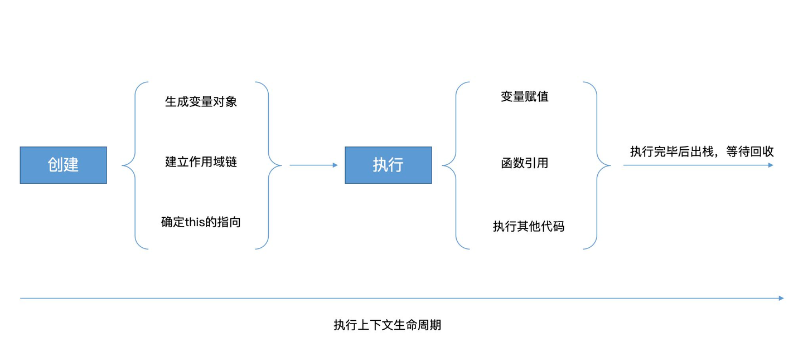
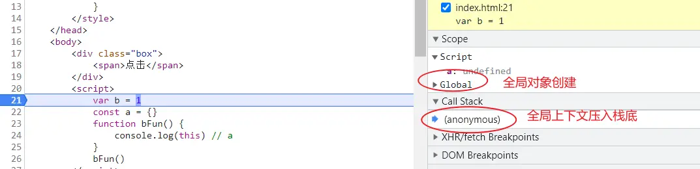
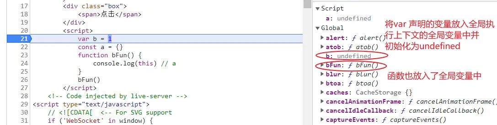
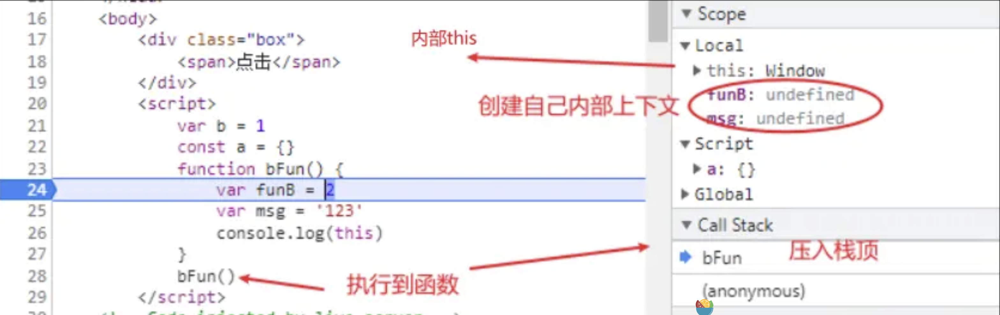

# JS执行上下文 （Execution Contexts）

执行上下文(EC)被定义为执行 JavaScript 代码的环境。
执行上下文的创建和执行是动态的，即在代码执行过程中会逐步创建和销毁执行上下文，所以也叫可执行环境。
JS代码都将在一个创建好的一个环境中执行，这个环境具备在特定时间代码可以访问的 this、变量、对象和函数的值。

:::info{title=说明}
ES5+与ES3的执行上下文创建过程不同，ES5+的执行上下文创建过程是确定的，而ES3的执行上下文创建过程是不确定的。
都2024了，本文不再对ES3的执行上下文创建过程进行讨论。
:::

***这类环境分为三种***：
- Global execution context 全局执行上下文(GEC)
- Functional execution context 函数执行上下文(FEC）
- Execution context inside 内部执行上下文 eval function


## 全局对象

全局对象提供在任何地方都可用的变量和函数。
默认情况下，那些内置在语言或环境中的一些属性和方法放一个单独的内存中（Date、Array、String、Number、setTimeout、setInterval），
例如浏览器的window 中就包含了内部提供一些方法，还有通过var/function声明的变量是直接存储到全局对象中

### globalThis

- ES2020引入了 globalThis 对象，它提供了跨环境访问全局对象的标准方法中提出要提供全局变量，简单说在浏览器中为window,在node环境中为global,但现在为统一目前已经指定了对应的标准，称之为globalThis
- 在不同js 环境中总是存在不同全局变量标准，往往在浏览器中window或者 frames，在WebWorkers中self，在Node 中global
- 使用场景假设我们的环境是一个浏览器，我们将在这里使用 window。如果脚本可能在其他环境中运行，最好使用 globalThis
- 下面代码在浏览器中打印你会得到true

```ts
console.log(window === globalThis); // true
```

## 生命周期

上下文生命周期分为三个阶段：`创建` -> `执行` -> `回收`



### 创建阶段

执行上下文的创建阶段是JavaScript引擎在执行JavaScript程序之前，对程序进行扫描和处理的阶段。
在创建阶段，JavaScript引擎会完成以下几个任务：

- ***创建变量对象（Variable Object）***：JavaScript引擎会创建当前执行上下文的变量对象，用于存储变量和函数声明。对于全局执行上下文来说，变量对象就是全局对象（例如window对象）；对于函数执行上下文来说，变量对象包括函数参数、内部变量和函数声明等。

- ***建立作用域链（Scope Chain）***：作用域链是由当前执行上下文的变量对象和其外部环境的变量对象链组成，用于解析变量的位置。JavaScript引擎会在创建阶段建立作用域链，以便在执行阶段使用。

- ***确定this指向***：在创建阶段，JavaScript引擎会确定当前执行上下文的this指向。对于全局执行上下文来说，this指向全局对象；对于函数执行上下文来说，this指向调用该函数的对象。

需要注意的是，在创建阶段变量对象已经被创建，但变量的值还没有被赋予，因此在创建阶段访问变量时，变量的值为undefined。
在执行阶段，当变量的值被赋予后，变量的值就会被更新。

### 执行阶段

执行上下文的执行阶段是JavaScript引擎在编译阶段之后，对JavaScript程序进行逐行执行的阶段。在执行阶段，JavaScript引擎会完成以下几个任务：

- ***变量赋值***：在执行阶段，JavaScript引擎会逐行执行代码，并对变量进行赋值。如果变量还没有被声明，JavaScript引擎会抛出ReferenceError异常。

- ***函数调用***：如果代码中包含函数调用，JavaScript引擎会创建新的函数执行上下文，并将其压入执行上下文栈中。在函数执行完毕后，JavaScript引擎会从执行上下文栈中弹出该函数执行上下文，继续执行上一个执行上下文。

- ***闭包***：在执行阶段，如果函数内部引用了外部变量，就会形成闭包。JavaScript引擎会将外部变量的值保存在闭包中，以便在函数执行期间访问。

- ***垃圾回收***：在执行阶段，JavaScript引擎会定期执行垃圾回收，以便清理不再使用的内存。

需要注意的是，执行阶段是一个逐行执行的过程，一旦出现错误，JavaScript引擎就会立即停止执行，并抛出异常。
因此，在编写JavaScript程序时，需要注意代码的正确性和可读性，以便更好地调试程序。

## 执行上下文栈（调用栈、执行栈）

执行上下文栈是JavaScript中管理执行上下文的一种数据结构，它用于跟踪代码的执行，并管理代码执行时所需的上下文环境。执行上下文栈是一个后进先出（LIFO）的数据结构，即最后一个进入的执行上下文会被最先执行和弹出。

当JavaScript程序开始执行时，会创建全局执行上下文，并将其压入执行上下文栈中。随着代码的执行，每当遇到一个函数调用语句，JavaScript引擎就会创建一个新的函数执行上下文，并将其压入执行上下文栈中。当函数执行完毕后，JavaScript引擎会从执行上下文栈中弹出该函数执行上下文，并继续执行上一个执行上下文。

执行上下文栈的顶部始终是当前正在执行的代码所在的执行上下文。当执行上下文栈为空时，JavaScript程序执行结束

## 执行环境

### 全局执行上下文（Global execution context）

GEC全局执行上下文当打开页面时，首次加载一个Js文件或者运行一段Js代码， 则会在全局代码执行之前,先创建一个全局的执行上下文,并将这个全局执行上下文压入执行环境栈中 ，因此它位于堆栈的底部

在这个js运行的生命周期中，【GEC将只创建一次，只有一个】，即一个程序中只能存在一个全局执行上下文， 只有页面关闭时才会释放掉。

刷新页面时，会把之前的上下文全都释放调，然后创建全新的上下文

创建的全局上下文环境中将创建
- global object 全局对象(在不同环境中表现不同在浏览器中为window在node 中为global，当然在新es2020规范可以用globalThis代替)
- 创建this并将其绑定到全局对象
- 将变量声明存储在内存堆和全局执行上下文中的变量中，初始值为undefined,函数会提前声明,这个过程也称之为变量的作用域提升




### 函数的上下文（Functional execution context）

- 函数执行上下文FEC,作用是为每个函数调用创建一个执行上下文。但它不是在声明函数时创建的，而是在`调用函数时创建`
- 创建一个新的函数的上下文会被添加到执行栈的`顶部`
- 这个私有上下文可以保护里面的私有变量和外界互不干扰
- 即使是同一个函数但每一次被调用，都会创建一个新的私有上下文。
- 每当一个函数执行完毕，则这个函数的私有执行上下文也将从栈中弹出，等到所有函数都运行完毕，要关闭页面的时候，全局上下文也将出栈释放，程序运行结束。
- 只要当前上下文中的某些内容，被当前上下文以外的东西占用，那么当前上下文是不能被释放的`闭包`
- 调用过程，在创建函数上下文过程中，默认情况下，JS 引擎会在本地执行上下文中创建一个 arguments 对象和一个this对象，函数内部预期的键值对参数存储在 arguments 对象中。它还有一个名为 length 的默认属性，用于计算该函数有多少个参数。当函数的参数为​​空时，参数对象默认为长度：0。根据调用函数的方式，函数执行上下文中的this对象会发生变化。如果使用对象引用来调用它，则 this 的值设置为该对象。否则，此变量的值将设置为gloab对象或严格模式下为undefined。




### 内部执行上下文（Execution context inside）

JS 引擎遇到**eval()**函数时，就会构造一个执行上下文并将其推送到调用堆栈中。它评估作为参数传递的字符串


## 总结

执行上下文是JavaScript中一个重要的概念，用于描述代码执行时的环境。一个执行上下文可以看作是一个独立的环境，包含了当前代码执行所需的所有信息，如变量、函数、this指向等。JavaScript中有三种类型的执行上下文：全局执行上下文、函数执行上下文和eval函数执行上下文。

执行上下文分为两个阶段：创建阶段和执行阶段。在创建阶段，JavaScript引擎会对代码进行解析，并将变量和函数声明添加到当前执行上下文的作用域中。在执行阶段，JavaScript引擎会逐行执行代码，并完成变量赋值、函数调用、this指向、闭包和垃圾回收等任务。


## 参考

- https://mathiasbynens.be/notes/globalthis
- https://javascript.info/global-object
- https://tc39.es/ecma262/multipage/global-object.html#sec-global-object
- https://github.com/tc39/proposal-global
- https://www.javascripttutorial.net/javascript-execution-context/
- https://codeburst.io/js-demystified-04-execution-context-97dea52c8ac6