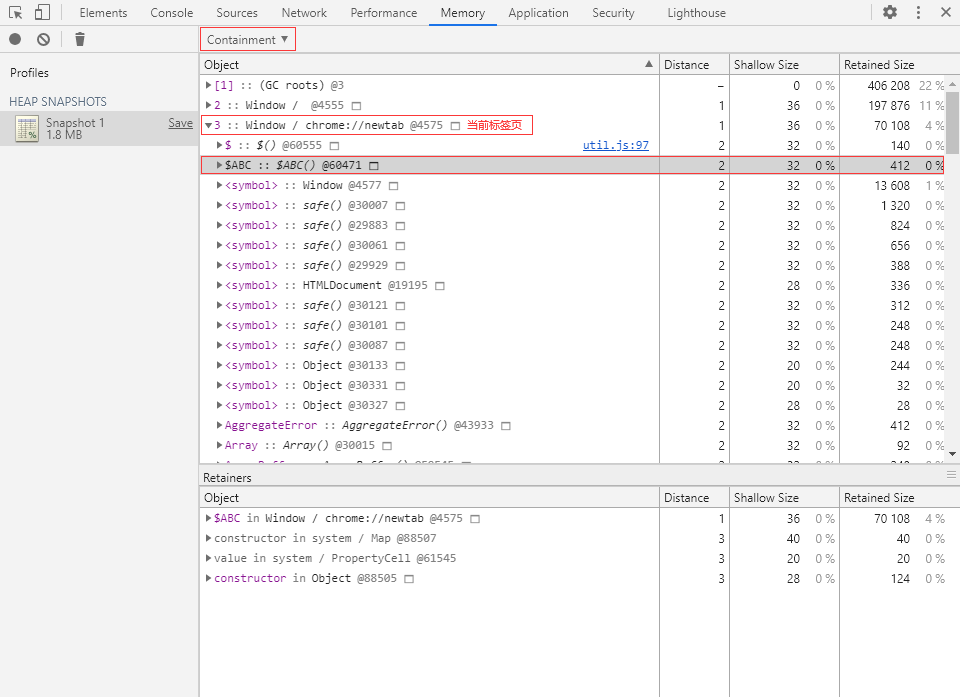

# 内存管理与优化

通常来说，所有应用程序的内存生命周期都是基本一致的：

`分配` -> `使用` -> `释放`

当我们使用高级语言编写程序时，往往不会涉及到内存的分配与释放操作，因为分配与释放均已经在底层语言中实现了。

对于 JavaScript 程序来说，内存的分配与释放是由 JavaScript 引擎自动完成的（目前的 JavaScript 引擎基本都是使用 C++ 或 C 编写的）。

但是这不意味着我们就不需要在乎内存管理，了解内存的更多细节可以帮助我们写出性能更好，稳定性更高的代码。

## 垃圾回收

垃圾回收即我们常说的 GC（Garbage collection），也就是清除内存中不再需要的数据，释放内存空间。
由于栈内存由操作系统直接管理，所以当我们提到 GC 时指的都是堆内存的垃圾回收。

基本上现在的浏览器的 JavaScript 引擎（如 V8 和 SpiderMonkey）都实现了垃圾回收机制，
引擎中的垃圾回收器（Garbage collector）会定期进行垃圾回收。

### 可达性（Reachability）

在 JavaScript 中，可达性指的是一个变量是否能够直接或间接通过全局对象访问到，
如果可以那么该变量就是可达的（Reachable），否则就是不可达的（Unreachable）。


上图中的节点 9 和节点 10 均无法通过节点 1（根节点）直接或间接访问，
所以它们都是不可达的，可以被安全地回收。

### 内存泄漏（Memory leak）

内存泄露指的是程序运行时由于某种原因未能释放那些不再使用的内存，造成内存空间的浪费。

轻微的内存泄漏或许不太会对程序造成什么影响，
但是一旦泄露变严重，就会开始影响程序的性能，甚至导致程序的崩溃。

### 垃圾回收算法（Algorithms）

垃圾回收的基本思路很简单：确定哪个变量不会再使用，然后释放它占用的内存。
实际上，在回收过程中想要确定一个变量是否还有用并不简单。
直到现在也还没有一个真正完美的垃圾回收算法，接下来介绍 3 种最广为人知的垃圾回收算法。

- 标记-清除（Mark-and-Sweep）
- 标记-整理（Mark-Compact）
- 引用计数（Reference counting）

具体算法请参考 [垃圾回收算法](https://mp.weixin.qq.com/s/EuJzQajlU8rpZprWkXbJVg) 

### V8 中的垃圾回收（GC in V8）

[V8 垃圾回收机制](https://v8.dev/blog/trash-talk)

## 优化管理

虽然我们写代码的时候一般不会直接接触内存管理，但是有一些注意事项可以让我们避免引起内存问题，甚至提升代码的性能。

### 全局变量（Global variable）

全局变量的访问速度远不及局部变量，应尽量避免定义非必要的全局变量。
在我们实际的项目开发中，难免会需要去定义一些全局变量，但是我们必须谨慎使用全局变量。
因为全局变量永远都是可达的，所以全局变量永远不会被回收  

### 隐藏类（HiddenClass）

在 V8 内部有一个叫做“隐藏类”的机制，主要用于提升对象（Object）的性能。

V8 里的每一个 JS 对象（JS Objects）都会关联一个隐藏类，隐藏类里面储存了对象的形状（特征）和属性名称到属性的映射等信息。

隐藏类内记录了每个属性的内存偏移（Memory offset），后续访问属性的时候就可以快速定位到对应属性的内存位置，从而提升对象属性的访问速度。

在我们创建对象时，拥有完全相同的特征（相同属性且相同顺序）的对象可以共享同一个隐藏类。

:::info{title=再想象一下}
我们可以把隐藏类想象成工业生产中使用的模具，有了模具之后，产品的生产效率得到了很大的提升。
但是如果我们更改了产品的形状，那么原来的模具就不能用了，又需要制作新的模具才行。

实际上的隐藏类远比本文所提到的复杂，但是今天的主角不是它，所以我们点到为止。
:::

#### 🌰 举个栗子

在 Chrome 浏览器 Devtools 的 Console 面板中执行以下代码：

```ts
// 对象 A
let objectA = {
  id: 'A',
  name: '吴彦祖'
};
// 对象 B
let objectB = {
  id: 'B',
  name: '彭于晏'
};
// 对象 C
let objectC = {
  id: 'C',
  name: '刘德华',
  gender: '男'
};
// 对象 A 和 B 拥有完全相同的特征
// 所以它们可以使用同一个隐藏类
// good!
```

随后在 Memory 面板打一个堆快照，通过堆快照中的 Comparison 视图可以快速找到上面创建的 3 个对象：

注：关于如何查看内存中的对象将会在文章的第二大部分中进行讲解，现在让我们专注于隐藏类。


在上图中可以很清楚地看到对象 A 和 B 确实使用了同一个隐藏类。

而对象 C 因为多了一个 gender 属性，所以不能和前面两个对象共享隐藏类。

:::info{title=录制比较视图}
通过相互比较多个快照来查找泄露的对象。
如需验证特定应用操作不会造成泄露（例如，通常一对直接和反向操作，比如打开文档然后关闭文档，不应留下任何垃圾），您可以遵循以下场景：

在执行操作之前截取堆快照。
执行某项操作（以您认为会导致泄露的方式与网页互动）。
执行反向操作（进行反向交互并重复几次）。
创建第二个堆快照，将此快照的视图更改为“Comparison”，并将其与快照 1 进行比较。
在 Comparison 视图中，将显示两个快照之间的差异。展开总条目时，系统会显示已添加和已删除的对象实例
:::

#### 🧀 动态增删对象属性

一般情况下，当我们动态修改对象的特征（增删属性）时，V8 会为该对象分配一个能用的隐藏类或者创建一个新的隐藏类（新的分支）。

例如动态地给对象增加一个新的属性：

注：这种操作被称为“先创建再补充（ready-fire-aim）”。

```ts
// 增加 gender 属性
objectB.gender = '男';
// 对象 B 的特征发生了变化
// 多了一个原本没有的 gender 属性
// 导致对象 B 不能再与 A 共享隐藏类
// bad!
```
动态删除（delete）对象的属性也会导致同样的结果：

```ts
// 删除 name 属性
delete objectB.name;
// A：我们不一样！
// bad!
```
不过，添加数组索引属性（Array-indexed properties）并不会有影响：

其实就是用整数作为属性名，此时 V8 会另外处理。

```ts
// 增加 1 属性
objectB[1] = '数字组引属性';
// 不影响共享隐藏类
// so far so good!
```

### 需减少动态操作对象

说了这么多，隐藏类看起来确实可以提升性能，那它和内存又有什么关系呢？
实际上，隐藏类也需要占用内存空间，这其实就是一种用空间换时间的机制。
如果由于动态增删对象属性而创建了大量隐藏类和分支，结果就是会浪费不少内存空间。

所以，我们要尽量避免动态增删对象属性操作，应该在构造函数内就一次性声明所有需要用到的属性。
如果确实不再需要某个属性，我们可以将属性的值设为 null

另外，相同名称的属性尽量按照相同的顺序来声明，可以尽可能地让更多对象共享相同的隐藏类。
即使遇到不能共享隐藏类的情况，也至少可以减少隐藏类分支的产生。


## 内存分析 

对于 Web 前端项目来说，分析内存的最佳工具非 Memory 莫属！

这里的 Memory 指的是 DevTools 中的一个工具，为了避免混淆，下面我会用“Memory 面板”或”内存面板“代称


在这个面板中，我们可以通过 3 种方式来记录内存情况：

- Heap snapshot：堆快照
- Allocation instrumentation on timeline：内存分配时间轴
- Allocation sampling：内存分配采样
小贴士：点击面板左上角的 Collect garbage 按钮（垃圾桶图标）可以主动触发垃圾回收。

🤓 在正式开始分析内存之前，让我们先学习几个重要的概念：

#### 💡 浅层大小（Shallow Size）

浅层大小指的是当前对象自身占用的内存大小。

浅层大小不包含自身引用的对象。

#### 💡 保留大小（Retained Size）

保留大小指的是当前对象被 GC 回收后总共能够释放的内存大小。

换句话说，也就是当前对象自身大小加上对象直接或间接引用的其他对象的大小总和。

需要注意的是，保留大小不包含那些除了被当前对象引用之外还被全局对象直接或间接引用的对象。

### 堆快照（Heap snapshot）

堆快照可以记录页面当前时刻的 JS 对象以及 DOM 节点的内存分配情况。


在堆快照结果页面中，我们可以使用 4 种不同的视图来观察内存情况：

- ***Summary***：摘要视图
- ***Comparison***：比较视图
- ***Containment***：包含视图
- ***Statistics***：统计视图

### 摘要视图（Summary）

摘要视图根据 Constructor（构造函数）来将对象进行分组，我们可以在 Class filter（类过滤器）中输入构造函数名称来快速筛选对象。


#### 页面中的几个关键词：

- Constructor：构造函数。
- Distance：（根）距离，对象与 GC 根之间的最短距离。
- Shallow Size：浅层大小，单位：Bytes（字节）。
- Retained Size：保留大小，单位：Bytes（字节）。
- Retainers：持有者，也就是直接引用目标对象的变量。

##### 持有者（Retainers）

Retainers 栏在旧版的 Devtools 里叫做 Object's retaining tree（对象保留树）。
Retainers 下的对象也展开为树形结构，方便我们进行引用溯源。

在视图中的构造函数列表中，有一些用“()”包裹的条目：

- (compiled code)：已编译的代码。
- (closure)：闭包函数。
- (array, string, number, symbol, regexp)：对应类型（Array、String、Number、Symbol、RegExp）的数据。
- (concatenated string)：使用 concat() 函数拼接而成的字符串。
- (sliced string)：使用 slice()、substring() 等函数进行边缘切割的字符串。
- (system)：系统（引擎）产生的对象，如 V8 创建的 HiddenClasses（隐藏类）和 DescriptorArrays（描述符数组）等数据。

#### 描述符数组（DescriptorArrays）

描述符数组主要包含对象的属性名信息，是隐藏类的重要组成部分。
不过描述符数组内不会包含整数索引属性。
而其余没有用“()”包裹的则为全局属性和 GC 根。
另外，每个对象后面都会有一串“@”开头的数字，这是对象在内存中的唯一 ID。

小贴士：按下快捷键 Ctrl/Command + F 展示搜索栏，输入名称或 ID 即可快速查找目标对象。

#### 实践一下：实例化一个对象

1) 切换到 Console 面板，执行以下代码来实例化一个对象：

```ts
function TestClass() {
  this.number = 123;
  this.string = 'abc';
  this.boolean = true;
  this.symbol = Symbol('test');
  this.undefined = undefined;
  this.null = null;
  this.object = { name: 'pp' };
  this.array = [1, 2, 3];
  this.getSet = {
    _value: 0,
    get value() {
      return this._value;
    },
    set value(v) {
      this._value = v;
    }
  };
}
let testObject = new TestClass();
```

2) 回到 Memory 面板，打一个堆快照，在 Class filter 中输入“TestClass”：

可以看到内存中有一个 TestClass 的实例，该实例的浅层大小为 80 字节，保留大小为 876 字节。


:::info{title=注意到了吗?}
堆快照中的 TestClass 实例的属性中少了一个名为 number 属性，这是因为堆快照不会捕捉数字属性。
:::

3) 这是字符串的堆快照，对比下区别


### 比较视图（Comparison）

只有同时存在 2 个或以上的堆快照时才会出现 Comparison 选项。

比较视图用于展示两个堆快照之间的差异。
使用比较视图可以让我们快速得知在执行某个操作后的内存变化情况（如新增或减少对象）。
通过多个快照的对比还可以让我们快速判断并定位内存泄漏。

文章前面提到[隐藏类](#隐藏类hiddenclass)的时候，就是使用了比较视图来快速查找新创建的对象。

:::info{title=建议在无痕模式下打开 Devtools}
普通标签页会受到浏览器扩展或者其他脚本影响，内存占用不稳定。
使用无痕窗口的标签页可以保证页面的内存相对纯净且稳定，有利于我们进行对比。
另外，建议打开窗口一段之间之后再开始测试，这样内存会比较稳定（控制变量）。
:::

### 包含视图（Containment）

***包含视图***用于展示对象之间的引用关系。

包含视图可以让我们快速得知某个对象引用了哪些对象，从而快速定位内存泄漏。

包含视图就是程序对象结构的“鸟瞰图（Bird's eye view）”，允许我们通过全局对象出发，一层一层往下探索，从而了解内存的详细情况。


#### 包含视图中有以下几种全局对象：

***GC roots（GC 根）***

GC roots 就是 JavaScript 虚拟机的垃圾回收中实际使用的根节点。

GC 根可以由 Built-in object maps（内置对象映射）、Symbol tables（符号表）、VM thread stacks（VM 线程堆栈）、Compilation caches（编译缓存）、Handle scopes（句柄作用域）和 Global handles（全局句柄）等组成。

***DOMWindow objects（DOMWindow 对象）***

DOMWindow objects 指的是由宿主环境（浏览器）提供的顶级对象，
也就是 JavaScript 代码中的全局对象 window，每个标签页都有自己的 window 对象（即使是同一窗口）。

***Native objects（原生对象）***

Native objects 指的是那些基于 ECMAScript 标准实现的内置对象，
包括 Object、Function、Array、String、Boolean、Number、Date、RegExp、Math 等对象。

#### 实践一下

① 切换到 Console 面板，执行以下代码来创建一个构造函数 $ABC：

构造函数命名前面加个 $ 是因为这样排序的时候可以排在前面，方便找。

```ts
function $ABC() {
  this.name = 'pp';
}
```

② 切换到 Memory 面板，打一个堆快照，切换为 Containment 视图：

在当前标签页的全局对象下就可以找到我们刚刚创建的构造函数 $ABC。



### 统计视图（Statistics）

统计视图用于展示对象在内存中的分布情况。


在该视图里的空心饼图中共有 6 种颜色，各含义分别为：

- 红色：Code（代码）
- 绿色：Strings（字符串）
- 蓝色：JS arrays（数组）
- 橙色：Typed arrays（类型化数组）
- 紫色：System objects（系统对象）
- 白色：空闲内存

## 参考

- [JavaScript 内存管理](https://developer.mozilla.org/zh-CN/docs/Web/JavaScript/Memory_Management)
- [录制堆快照](https://developer.chrome.com/docs/devtools/memory-problems/heap-snapshots?hl=zh-cn)
- [JavaScript 内存详解 & 分析指南](https://mp.weixin.qq.com/s/EuJzQajlU8rpZprWkXbJVg)