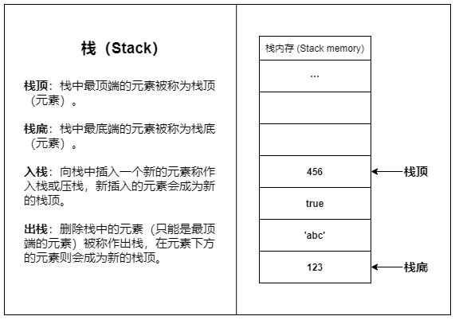
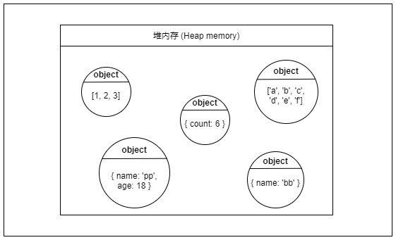

# 栈与堆 Stack & Heap

了解程序的运行方式，我们首先要了解栈与堆的概念。
但很多同学经常会混淆堆栈的概念，甚至有人把栈和堆认为是同一个东西；

其实并不然，`栈(stack)` 与 `堆(heap)` 是两种东西，堆是堆，栈是栈。

## 栈与堆的区别

### 内存与数据结构中的`堆栈`

在内存与数据结构都有`栈`和`堆`的说法；

其中内存中的栈借鉴了数据结构栈的概念，而内存中的堆与数据结构中的堆概念完成时两回事，同名只是碰巧而已；

这也是很多人对堆栈概念理解不清的原因；

我们为了区别内存与数据结构中的区别，我们通常把内存中的栈称为`栈内存（Stack memory）`，把内存中的堆称为`堆内存（Heap memory）`

|| 堆 | 栈 |  
| --- | --- | --- |
| 数据结构 | 只允许在结构的一端操作数据，所有数据都遵循后进先出（Last-In First-Out，LIFO）的原则 | 堆也是一种常见的数据结构，是最高效的优先级队列。堆通常是一个可以被看作一棵完全二叉树的数组对象 |
| 内存 | 栈内存使用了栈的结构 | 它和数据结构中的堆没半毛钱关系，堆内存是一大片内存空间，堆内存的分配是动态且不连续的 |

下面我们将围绕着JavaScript的内存机制来讲解栈内存与堆内存的区别。

### 栈内存

栈内存之所以叫做栈内存，是因为栈内存使用了栈的结构。
栈内存是一段连续的内存空间，得益于栈结构的简单直接，栈内存的访问和操作速度都非常快。
栈内存的容量较小，主要用于存放函数调用信息和变量等数据，大量的内存分配操作会导致栈溢出（Stack overflow）。
栈内存的数据储存基本都是临时性的，数据会在使用完之后立即被回收（如函数内创建的局部变量在函数返回后就会被回收）。

现实生活中最贴切的的例子就是羽毛球桶，通常我们只通过球桶的一侧来进行存取，最先放进去的羽毛球只能最后被取出，而最后放进去的则会最先被取出。

简单来说：`栈内存适合存放生命周期短、占用空间小且固定的数据`。

### 堆内存

堆内存是一大片内存空间，堆内存的分配是动态且不连续的，程序可以按需申请堆内存空间，但是访问速度要比栈内存慢不少。
堆内存里的数据可以长时间存在，无用的数据需要程序主动去回收，如果大量无用数据占用内存就会造成内存泄露（Memory leak）。

堆内存叫这个名字其实比堆数据结构更为合适，可以想象一下，一个空旷的空间，把东西随意放在这个空间里，东西多了，也不介意堆在一起;

简单来说：`堆内存适合存放生命周期长，占用空间较大或占用空间不固定的数据`。

### 对比

|| 栈内存 | 堆内存 |
| --- | --- | --- |
| 结构 | 由操作系统自动分配内存空间，自动释放，存储的是基础变量以及一些对象的引用变量，占据固定大小的空间。 | 由操作系统动态分配的内存，大小不定也不会自动释放，一般由程序员分配释放，也可由垃圾回收机制回收（程序结束时由运行环境回收）。 |
| 线程 | 独占，栈内数据共享 | 同一个进程下的多个线程共享一个堆内存 |
| 空间 | 空间小，有限度；  栈内存大小有系统决定，每个线程拥有独立的内存空间，window 默认大小为1M；  栈中的内容是操作系统自动创建、自动回收，占据固定大小的空间 | 空间大；  在 Node.js 中，堆内存默认上限在 64 位系统中约为 1.4 GB，在 32 位系统中约为 0.7 GB。  而在 Chrome 浏览器中，每个标签页的内存上限约为 4 GB（64 位系统）和 1 GB（32 位系统）。 堆是操作系统动态分配的大小不定的内存，因此方便存储和开辟内存空间 |
| 内存回收 | 自动回收；栈内存由系统回收，更加容易管理内存空间。 | 堆内存，需手动回收，但现在各环境都自带垃圾回收机制(GC)比较强大，可以适应大部分情况 |
| 访问速度 | 快，栈内存的访问速度快，因为栈内存的访问速度快，所以栈内存的空间也比较小。 | 慢，堆内存的访问速度慢，因为堆内存的访问速度慢，所以堆内存的空间也比较大。 |
| 溢出 | 循环创建对象或大的对象 | 可以递归调用方法，这样随着栈深度的增加，JVM （虚拟机）维持着一条长长的方法调用轨迹，直到内存不够分配，产生栈溢出。  程序上，动态的分配的堆内存，由于某种原因程序未释放或无法释放，造成系统的浪费，导致程序的运行速度减慢，甚至系统崩溃等严重后果|
| 主要作用 | 栈内存也叫执行栈或调用栈，当函数被推入执行栈，JS 引擎就开始解析函数体，在堆里存储此函数内部声明的变量、把新的函数调用推入栈顶，或是分发到WEB API容器。| 堆内存的主要作用是存储声明的变量和声明的函数 |

### 图解

## 总结

### 为什么会有栈内存和堆内存之分？

通常与垃圾回收机制有关。***为了使程序运行时占用的内存最小***。

当一个方法执行时，每个方法都会建立自己的内存栈，在这个方法内定义的变量将会逐个放入这块栈内存里，随着方法的执行结束，这个方法的内存栈也将自然销毁了。因此，所有在方法中定义的变量都是放在栈内存中的；

当我们在程序中创建一个对象时，这个对象将被保存到运行时数据区中，以便反复利用（因为对象的创建成本通常较大），这个运行时数据区就是堆内存。堆内存中的对象不会随方法的结束而销毁，即使方法结束后，这个对象还可能被另一个引用变量所引用（方法的参数传递时很常见），则这个对象依然不会被销毁，只有当一个对象没有任何引用变量引用它时，系统的垃圾回收机制才会在核实的时候回收它。

### 何时产生栈内存和堆内存?

当程序创建数据，就会占用内存，开辟了堆栈两类空间。

当我们在程序中创建对象时，这个对象将被保存到运行时数据区中，以便反复利用（因为对象的创建成本通常较大），这个运行时数据区就是堆内存。
堆内存中的对象不会随方法的结束而销毁，即使方法结束后，这个对象还可能被另一个引用变量所引用（方法的参数传递时很常见），则这个对象依然不会被销毁，
只有当一个对象没有任何引用变量引用它时，系统的垃圾回收机制才会在核实的时候回收它。

## 名词解释

***LIFO*** Last In First Out，即后进先出。
***FIFO*** First In First Out，即先进先出。
***栈 Stack*** 栈是一种后进先出的线性表，可以用数组来实现。栈的特点是先进后出，后进先出。
***堆 Heap*** 堆是一种特殊的树形结构，可以用数组来实现。堆的特点是先进先出，后进后出。

## 参考

- [JavaScript中的堆栈 stack heap 队列 数据结构学习 最全图片讲解](https://zhuanlan.zhihu.com/p/489973608?utm_id=0)
- [将stack翻译成"堆栈"实在是误人子弟](https://www.cnblogs.com/yjf512/p/6044656.html)
- [JavaScript 内存详解 & 分析指南](https://mp.weixin.qq.com/s/EuJzQajlU8rpZprWkXbJVg)
- [JS中的堆(Heap)栈(Stack)内存](https://www.kancloud.cn/cyyspring/more/2537022)