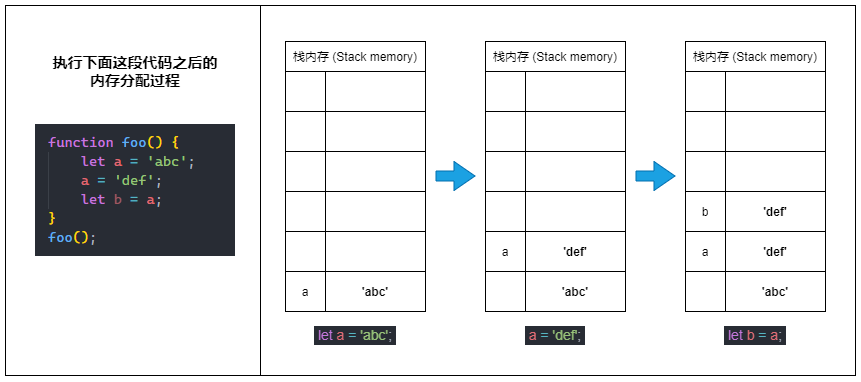
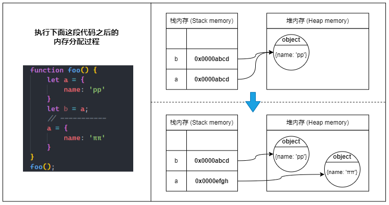
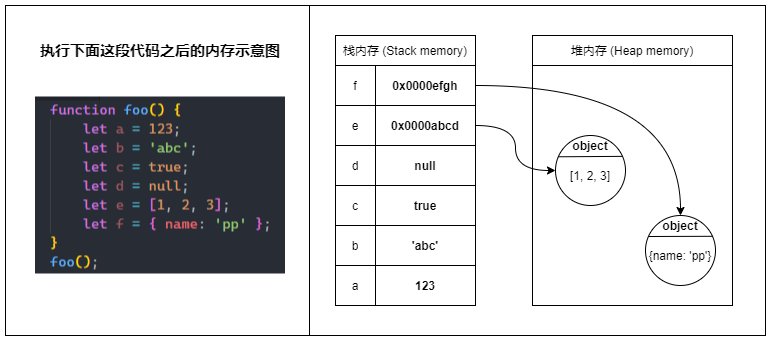

# 变量与内存

当 JavaScript 程序运行时，在非全局作用域中产生的局部变量均储存在栈内存中。

## 储存变量（Store variables）

但是，只有原始类型的变量是真正地把值储存在栈内存中。
而引用类型的变量只在栈内存中储存一个引用（reference），这个引用指向堆内存里的真正的值。

### 原始类型（Primitive type）

原始类型又称基本类型，包括 string、number、bigint、boolean、undefined、null 和 symbol（ES6 新增）。
原始类型的值被称为原始值（Primitive value）。

⑴ 当我们定义一个原始类型变量的时候，JavaScript 会在栈内存中激活一块内存来储存变量的值（原始值）。

⑵ 当我们更改原始类型变量的值时，实际上会再`激活一块新的内存来储存新的值`，并将变量指向新的内存空间，而不是改变原来那块内存里的值。

⑶ 当我们将一个原始类型变量赋值给另一个新的变量（也就是复制变量）时，也是会再激活一块新的内存，并将源变量内存里的值`复制`一份到新的内存里。



栈内存中的原始值一旦确定就不能被更改（不可变的）

### 引用类型（Reference type）

除了原始类型外，其余类型都属于引用类型，包括 Object、Array、Function、Date、RegExp、String、Number、Boolean 等等...
实际上 Object 是最基本的引用类型，其他引用类型均`继承自 Object`。也就是说，所有引用类型的值实际上都是对象。
引用类型的值被称为引用值（Reference value）。

⑴ 当我们定义一个引用类型的变量时，JavaScript 会先在堆内存中找到一块合适的地方来储存对象，并激活一块栈内存来储存对象的引用（堆内存地址），最后将变量指向这块栈内存。
 
:::info{title=所以当我们通过变量访问对象时，实际的访问过程应该是：}
变量 -> 栈内存中的引用 -> 堆内存中的值
:::

⑵ 当我们把引用类型变量赋值给另一个变量时，会将源变量指向的栈内存中的对象引用复制到新变量的栈内存中，所以实际上只是复制了个对象引用，并没有在堆内存中生成一份新的对象。

⑶ 而当我们给引用类型变量分配为一个新的对象时，则会直接修改变量指向的栈内存中的引用，新的引用指向堆内存中新的对象。



🤠 总之就是：***栈内存中的对象引用是可以被更改的（可变的）***。

### 变量的比较（Comparison）

变量的比较就是比较变量指向的栈内存中的值。

只要值不一样，变量就不相等。

这在原始类型中比较好理解，因为原始类型的值是不可变的。

但在对象类型中，就比较难理解，但也只要记清楚其引用值是否相等决定两个对象是否相等，不用管其指向堆内存的对象是否产生变化；

```ts
let a = { name: 'A', age: 10 }; 
// 赋值给另一个变量时, 只是复制引用值
let b = a;

// 复制引用值，引用值不产生变化
console.log(a === b); // true

// 堆内存中赋值
b.gender = 'male'; 

// 堆内存中赋值，不影响引用值
console.log(a === b); // true

// 虽然看过去一样，但a赋值了一个新的对象
a = { name: 'A', age: 10 }: 

// 赋值新的对象，引用值产生了变化
console.log(a === b); // false

```

### 深拷贝（Deep Clone）

当我们搞明白引用类型变量在内存中的表现时，就能清楚地理解为什么浅拷贝对象是不可靠的。
对于任何引用类型的变量，都应该使用深拷贝来复制，除非你很确定你的目的就是复制一个引用（慎用）。

### typeof null 

`typeof null`的结果是`object`，这是历史遗留问题，在 JavaScript 最初实现时，`null` 并没有被设计
null 栈内存的原始值是一个空指针，而不是一个引用值，null 并不是一个`对象面位量`

在Javascript中，不同的数据类型在底层都表示为二进制，比如：
- 000 - 对象，数据是对象的引用
- 1 - 整型，数据是31位带符号整数
- 010 - 双精度类型，数据是双精度数字
- 100 - 字符串，数据是字符串
- 110 - 布尔类型，数据是布尔值

二进制的前三位为0会被 typeof 判定为object类型。
而null是一个`空值`，其二进制表示全是0，自然前三位也是000，所以执行typeof的时候会返回object，产生假象。

### 类型的判断

除了null原始类型使用`typeof`外，其他类型都可以使用`instanceof`来判断。

```ts
Object.prototype.toString.call(null)'[object Null]'
Object.prototype.toString.call(undefined)'[object Undefined]'
Object.prototype.toString.call({})'[object Object]'
Object.prototype.toString.call('abc')'[object String]'
Object.prototype.toString.call(123)'[object Number]'
// 注意，这里的Number指类型，需要和内置对象Number区分开
```

数组推荐使用 `Array.isArray()` 来判断是否为数组

第三方库自定义方法用`isPlainObject`来判断是否为纯对象

```ts
// 简单的实现，覆盖99.99%的场景
function isPlainObject(obj) {
  return typeof obj === 'object' && obj !== null && Object.prototype.toString.call(obj) === '[object Object]';
}
```

## 储存变量的规则（Rules for storing variables）

在多数情况下，原始类型的数据储存在栈内存，而引用类型的数据（对象）则储存在堆内存;



在`全局作用域`下创建的所有变量都会成为全局对象（如 window 对象）的属性，也就是全局变量。
而全局对象储存在`堆内存`中，所以全局变量必然也会储存在堆内存中。

所以，在全局作用域中创建的变量需要手动回收，否则容易造成内存泄露。

```ts
window.xxx = null;
```

### 闭包（Closures）

在函数（局部作用域）内创建的变量均为局部变量。

当一个局部变量被当前函数之外的`其他函数`所引用（也就是发生了`逃逸`），
此时这个局部变量就不能随着当前函数的返回而被回收，那么这个变量就必须储存在`堆内存`中。

```ts
function getCounter() {
  let count = 0;
  function counter() {
    return ++count;
  }
  return counter;
}
// closure 是一个闭包函数
// 变量 count 发生了逃逸
let closure = getCounter();
closure(); // 1
closure(); // 2
closure(); // 3
```

而这里的`其它函数`就是常说的闭包；这里反直觉的规则，就是闭包的特性。


### 逃逸分析（Escape Analysis）

实际上，JavaScript 引擎会通过逃逸分析来决定变量是要储存在栈内存还是堆内存中。
简单来说，逃逸分析是一种用来分析变量的作用域的机制，分析对象的生命周期是否仅限于当前函数。
如果变量在函数外部被引用，那么 JavaScript 引擎会认为这个变量发生了`逃逸`。

```ts
function add(a, b){
  const obj = { x: a, y: b }
  return obj.x + obj.y
}
```

在V8引擎的解释器中，如下函数通过逃逸分析后优化结果: 

```ts
function add(a, b){
  const obj_x = a
  const obj_y = b
  return obj_x + obj_y
}
```

而逃逸分析也是`tree-shaking`实现的底层原理；