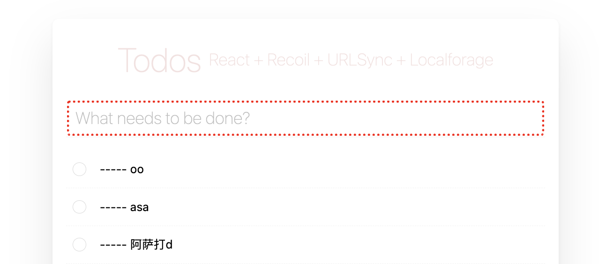
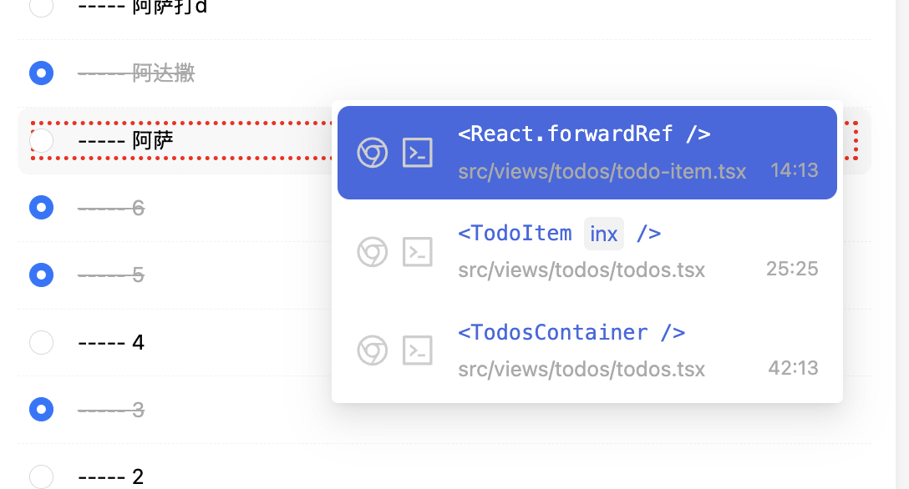
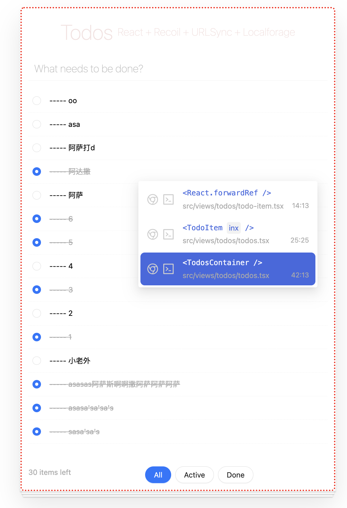
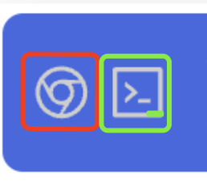
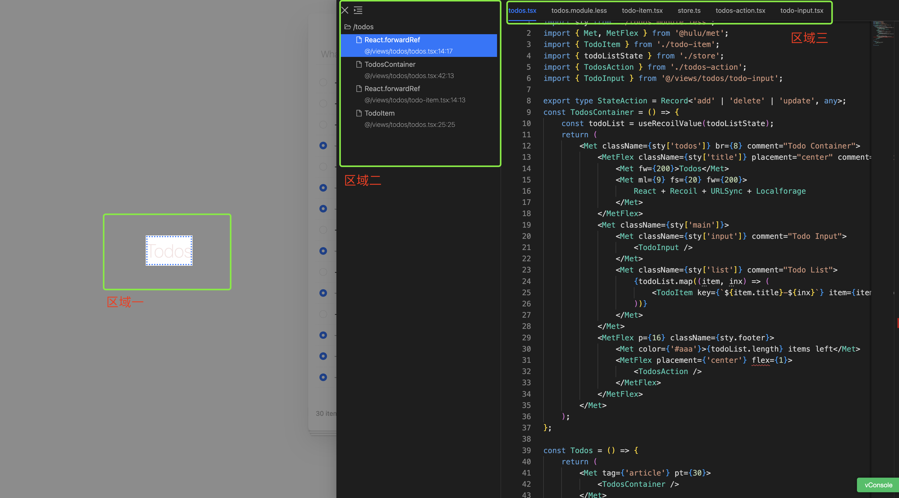

# 点击跳转到组件 

## 功能激活

* 在网页中，在键盘上按 `Option` , 移动鼠标在所需要的查看源码的组件上，即可出现如下的选框，表明当前所选的组件区域

## 选择组件

* `右键点击`，就会浮出一个菜单

*  菜单从上到下依次为所选组件向上广播的组件

* 上下选择菜单上的组件区域，对应网页上就会标出所对应的组件区域
* 选择好所对应的组件，点选菜单打开本地编辑器(VSCode) 或 打开在线编辑器

## 在线编辑代码 

* 推荐打开在线编辑器，因为在线编辑器可以实时预览所选组件的效果
  + 区域一: 可视化预览
  + 区域二: 所选区域传播路径，选择该路径可以查看区域一的预览效果
  + 区域三: 所打开组件源码所导入的文件，可以改相关文件

## 灵感来源

* [Click to component](https://github.com/ericclemmons/click-to-component) 
* [React Dev Inspector](https://react-dev-inspector.zthxxx.me/docs) 

## 使用场景

* 仅在 dev 模式下生效
